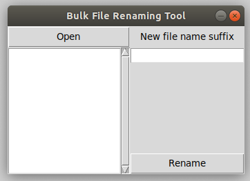

# Bulk File Rename

Sometimes, we need to name all the files in a directory according to certain conventions. For
example, we can rename all the files in a directory with File0001.jpg , where the numbers
increase based on the number of files in the directory. Doing this manually can be stressful
and repetitive.
  
The Bulk File Rename Tool allows users to rename a large number of files, without having to
manually rename files.

This saves users a lot of time. It spares them the trouble of having to do boring repetitive
work and make mistakes. With the Bulk File Rename Tool, users can rename files in a couple
of seconds without any mistakes.

### Usage
With python installed on your machine, executing the file "fileRenaming.py" will run the program. No external libraries are required as the program is written using Tkinter that comes pre-installed with python.

